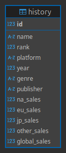
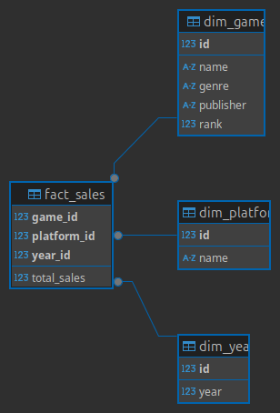

# pwc-challenge
PwC - DE Challenge

## Objetive

Develop a system capable of quickly searching and returning entities, the search should be the primary driving factor. The entities should be stored in a data warehouse, either with star or snowflake schema and the search should be performed via a VectorDB. The VectorDB does not need to have the complete entity and could have a subset of fields that facilitates the searching.

The application could be a command line application (CLI), a text-based user interface (TUI) or a
REST API.

## Technical Details

All the backend code should be Python and hosted in Github as a public repo, the Data Warehouse in a SQL Database and the VectorDB should be Typesense.

## Source Data

The candidate is free to use any data they choose as long as it is publicly available and has high
volumetry. Typesense has some examples to pick from.

## Mandatory Features

- [x] Create the necessary diagrams that reflect the structure of the data schema
- [x] Use a schema that has at least 4 tables and several relationships
- [x] The SQL DB should be accessible (either using files or credentials).
- [x] The search query should use at least one filter criteria
- [x] The VectorDB should be working locally through Docker/Docker Compose
- [x] A full CRUD of at least one of the entities should be possible

## Optional Features (include at least 1):

- Use a hosted DB. e.g. Supabase.
- [x] Use an ORM (e.g. SQLModel/SQLAlchemy).
- [x] Lock your dependencies (e.g. pipenv, poetry or pdm).
- Add unstructured data to the data warehouse. You can use dummy files to test this
functionality.
- Use PubSub pattern (communication based on Queues). E.g. Kafka, redislite+Celery, redislite+rq, huey (with redislite, sqlite o in-memory). Redislite+dramatiq.
- Implement Repository pattern to access the table data
- [x] Use FastAPI to create a REST API
- [x] Add unit tests using pytest

## Suggested but not required Tech Stack

For the Python code

- SQLite
- SQLModel/SQLAlchemy

For hosting the Source Database and Datawarehouse:

- Supabase (free plan)
- Typesense

# Resolution Plan

### Desing and development choices

- Using [pdm](https://pdm-project.org/en/latest/) as dependency manager
- IDE: PyCharm
- OS: Ubuntu 24.04.1 LTS
- Interface: RestAPI with FASTAPI
- Relational DB: SQLite (local)
- Datasets:
  - https://www.kaggle.com/datasets/gregorut/videogamesales
    
      Cols DB: Rank, Name, Platform, Year, Genre, Publisher, NA_Sales, EU_Sales, JP_Sales, Other_Sales

      Fact: Sells (Name, Platform, Year, Total Sales)
    
      Dims: 
    
      - Game (Name, Publisher, Genre, Rank)
      - Platform (Name, Manufacturer as an extra table)
      - Year
    > Despite the low volumetry and complexity, I chose this dataset and centered on desinging a solution easily adaptable
- SQLite as local Data Base 
- Docker Compose to run Typesense locally
- PyTest for testing
- SQL Alchemy (ORM)
- Polars to parse CSV (original dataset comes in this format)
- 2 DataBases (accessible from the .db files): 
  - Raw: Has all the data (almost unprocessed) from the dataset
  > 
    - DW: Has the Star Schema
  > 


## Running the project


```commandline
docker compose up
uvicorn src.app:app --reload
```